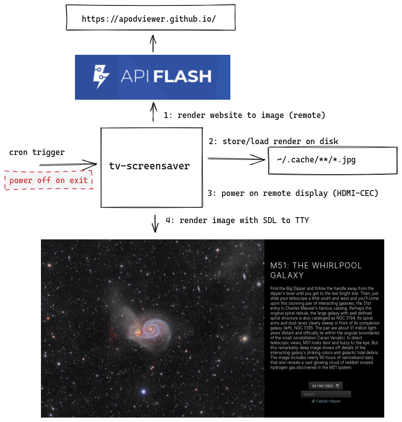

# tv-screensaver

Turn a TV into nice daily screensaver with a Raspberry Pi.

## Requirements

The Raspberry Pi must be connected to the display **directly by HDMI**. The device must support HDMI-CEC, and cannot be connected by e.g. a USB adapter.

Some additional packages are required:

```bash
sudo apt install \
    # For HDMI CEC remote device control
    cec-utils \
    # For displaying images in a terminal
    fim
```

## Architecture

Due to local resource limitations, it is not feasible to run a browser on the rPi (model 1).

Instead, a remote resource renders the given website to an image, which is then displayed.
Display is via SDL direct to TTY, obviating the need for an X session/window manager etc.

The remote display is powered on and off when required via HDMI-CEC.



## Installation

Clone the repo to a known location on your device:

```bash
cd ~
git clone https://github.com/tommilligan/tv-screensaver
```

### Secrets

An api token for [apiflash.com](https://apiflash.com/) is required - you can sign up instantly for a free trial, suitable for one request per day.

The api token should be placed in a `.env` file adjacent to `./entrypoint.sh`:

```bash
# ~/tv-screensaver/.env
API_FLASH_TOKEN=tokenvaluetokenvaluetokenvalue
```

### Invocation

You can test a one-off run of the screensaver with a short duration to test it works.

You should trigger this run from a remote SSH session or similar, as `tty1` will be used for display (so you probably shouldn't be typing on it).

The duration given is in seconds, and is until the display is powered off again.

```bash
~/tv-screensaver/entrypoint.sh --duration 120
```

#### Scheduling

**Note:** scheduling this job means the remote display will be auto-powered off at a fixed time every day. Check this is okay!

To run the screensaver periodically, set up a cronjob. Add an entry to the existing `/etc/crontab` file.

Note that you will also need to specify the user to run the script as (`pi`), and the full absolute path to execute.

```bash
# /etc/crontab
...
# run every day at 6am, and shutdown after 12 hours
0 6 * * 1-5 pi /home/pi/tv-screensaver/entrypoint.sh --duration 43200
```

## Development

### Optional arguments

Mainly for testing, the following optional arguments are provided for `./tvs.sh`:

- `--no-download`: Do not download a new screensaver image, use the cache. Used to preserve apiflash quota
- `--no-cec`: Skip any HDMI CEC comamnds. Used for testing on devices without HDMI-CEC connection/support.
